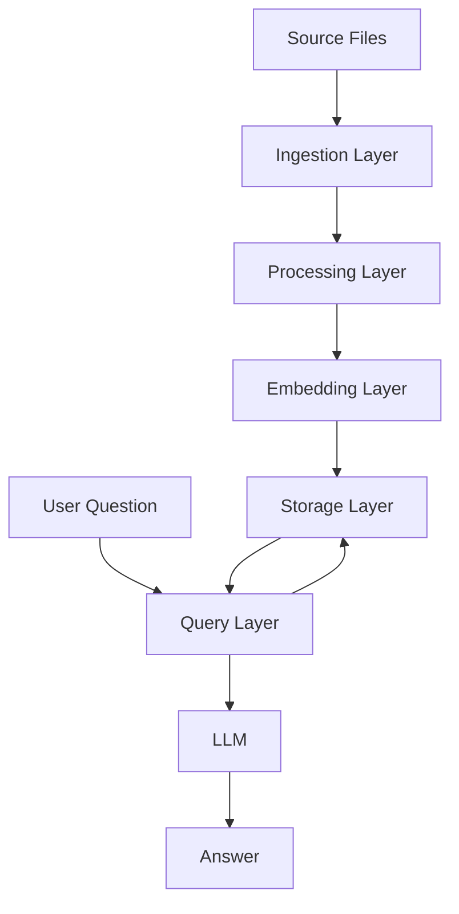

# RAG Chatbot Design Document

## Overview

The RAG (Retrieval-Augmented Generation) chatbot is a Python-based system that processes multi-format knowledge bases (PDFs, audio, and video files) and enables users to ask questions about the content. The system extracts text from various sources, chunks it semantically, stores it as vector embeddings in a database, and uses retrieval-augmented generation to provide accurate answers.

The architecture follows a pipeline approach with distinct stages: ingestion, processing, storage, retrieval, and generation. Each stage is modular and can be tested independently.

## Architecture

The system consists of five main layers:

1. **Ingestion Layer**: Handles loading and initial processing of source files (PDF, audio, video)
2. **Processing Layer**: Transforms raw content into structured text chunks
3. **Embedding Layer**: Converts text chunks into vector representations
4. **Storage Layer**: Manages the vector database for efficient similarity search
5. **Query Layer**: Handles user questions, retrieval, and answer generation



## Components and Interfaces

### 1. Document Loaders

**PDFLoader**
- Responsibility: Extract text from PDF files
- Library: PyPDF2 or pdfplumber
- Interface:
  - `load(file_path: str) -> str`: Returns extracted text
  - `load_with_metadata(file_path: str) -> dict`: Returns text with page numbers

**AudioTranscriber**
- Responsibility: Convert audio to text
- Library: openai-whisper (local, no cloud connection required)
- Model: base or small for balance of speed and accuracy
- Interface:
  - `transcribe(audio_path: str) -> str`: Returns transcribed text
  - `transcribe_with_timestamps(audio_path: str) -> list[dict]`: Returns segments with timestamps

**VideoProcessor**
- Responsibility: Extract audio from video files
- Library: moviepy or ffmpeg-python
- Interface:
  - `extract_audio(video_path: str, output_path: str) -> str`: Extracts audio and returns path
  - `process_video(video_path: str) -> str`: Extracts audio and triggers transcription

### 2. Text Processor

**TextChunker**
- Responsibility: Split text into semantic chunks
- Strategy: Use LangChain's RecursiveCharacterTextSplitter with Hugging Face tokenizer
- Library: langchain-text-splitters with sentence-transformers tokenizer
- Interface:
  - `chunk_text(text: str) -> list[str]`: Returns text chunks using default configuration
  - `chunk_with_metadata(text: str, source: str) -> list[dict]`: Returns chunks with source info

Configuration:
- Default chunk size: 512 tokens
- Default overlap: 75 tokens (15% of chunk size)
- Tokenizer: sentence-transformers/all-mpnet-base-v2 (matches embedding model)
- Implementation: RecursiveCharacterTextSplitter.from_huggingface_tokenizer

### 3. Embedding Engine

**EmbeddingModel**
- Responsibility: Generate vector embeddings from text
- Library: sentence-transformers
- Model: all-mpnet-base-v2 (768 dimensions, high quality)
- Interface:
  - `embed(text: str) -> list[float]`: Returns single embedding
  - `embed_batch(texts: list[str]) -> list[list[float]]`: Returns multiple embeddings

Model selection rationale:
- Use sentence-transformers for local execution
- Model: all-mpnet-base-v2 provides 768-dimensional embeddings
- Higher dimensionality (768) provides better semantic representation than smaller models
- Same tokenizer used for chunking ensures perfect alignment

### 4. Vector Database

**VectorStore**
- Responsibility: Store and query vector embeddings
- Library: Qdrant (recommended for Python 3.14 compatibility and performance)
- Interface:
  - `add_documents(texts: list[str], embeddings: list[list[float]], metadata: list[dict]) -> None`
  - `query(query_embedding: list[float], top_k: int) -> list[dict]`: Returns top-k similar documents
  - `clear() -> None`: Clears the database

Schema:
```python
{
    "id": "unique_id",
    "vector": [0.1, 0.2, ...],  # 768-dimensional embedding
    "payload": {
        "text": "chunk content",
        "source": "filename",
        "chunk_index": 0,
        "source_type": "pdf|audio|video"
    }
}
```

### 5. RAG Pipeline

**RAGChatbot**
- Responsibility: Orchestrate the entire RAG workflow
- Interface:
  - `ingest_pdf(file_path: str) -> None`: Process and store PDF
  - `ingest_audio(file_path: str) -> None`: Process and store audio
  - `ingest_video(file_path: str) -> None`: Process and store video
  - `ask(question: str, top_k: int = 5) -> str`: Answer question using RAG

Default Configuration:
- Chunk size: 512 tokens
- Chunk overlap: 75 tokens (15%)
- Top-k retrieval: 5 chunks
- Embedding model: all-mpnet-base-v2 (768 dimensions)

**LLMInterface**
- Responsibility: Generate answers using retrieved context
- Library: LM Studio local server with OpenAI-compatible API
- Model: Small local model (e.g., Llama 2 7B, Mistral 7B, or similar)
- Interface:
  - `generate(question: str, context: list[str]) -> str`: Returns generated answer

Connection:
- Connect to LM Studio's local server (default: http://localhost:1234/v1)
- Use OpenAI-compatible API format
- No API key required for local connection

Prompt template:
```
You are a helpful assistant answering questions about lecture content.

Context:
{context_chunks}

Question: {question}

Answer based on the context provided. If the context doesn't contain relevant information, say so.
```

## Data Models

### Document
```python
@dataclass
class Document:
    text: str
    source: str
    source_type: str  # 'pdf', 'audio', 'video'
    metadata: dict
```

### Chunk
```python
@dataclass
class Chunk:
    text: str
    embedding: list[float]
    source: str
    chunk_index: int
    metadata: dict
```

### QueryResult
```python
@dataclass
class QueryResult:
    question: str
    retrieved_chunks: list[Chunk]
    answer: str
    similarity_scores: list[float]
```

## Correctness Properties

*A property is a characteristic or behavior that should hold true across all valid executions of a system—essentially, a formal statement about what the system should do. Properties serve as the bridge between human-readable specifications and machine-verifiable correctness guarantees.*

Property 1: PDF text extraction completeness
*For any* valid PDF file, extracting text should return a non-empty string when the PDF contains text content
**Validates: Requirements 1.1**

Property 2: PDF page order preservation
*For any* multi-page PDF file, the extracted text should preserve the order of content as it appears across pages
**Validates: Requirements 1.2**

Property 3: Audio transcription produces text
*For any* valid audio file in a supported format, transcription should return a non-empty text string
**Validates: Requirements 2.1, 2.3**

Property 4: Video processing workflow
*For any* valid video file, processing should extract audio and produce a text transcription without manual intervention
**Validates: Requirements 3.1, 3.2**

Property 5: Text chunking respects size limits
*For any* text and chunk size configuration, all generated chunks (except possibly the last) should not exceed the specified chunk size
**Validates: Requirements 4.1**

Property 6: Chunk overlap preservation
*For any* text split into multiple chunks with overlap, consecutive chunks should share content at their boundaries
**Validates: Requirements 4.3**

Property 7: Embedding generation consistency
*For any* text chunk, generating embeddings multiple times with the same model should produce identical vector representations
**Validates: Requirements 5.2**

Property 8: Embedding-text association
*For any* text chunk that is embedded and stored, retrieving the embedding should return the associated original text
**Validates: Requirements 5.4, 6.1**

Property 9: Metadata preservation in storage
*For any* document chunk stored with metadata (source, chunk_index, source_type), retrieving that chunk should return all original metadata
**Validates: Requirements 6.2**

Property 10: Incremental storage without data loss
*For any* existing vector database, adding new embeddings should not remove or modify previously stored embeddings
**Validates: Requirements 6.3**

Property 11: Query result limiting
*For any* question and top_k parameter, the retrieval system should return exactly min(top_k, total_documents) results
**Validates: Requirements 7.3**

Property 12: Question embedding uses same model
*For any* question, the embedding generated for the question should use the same embedding model as the document chunks
**Validates: Requirements 7.1**

Property 13: Context formatting for LLM
*For any* set of retrieved chunks, the prompt sent to the LLM should include all chunk texts and distinguish between different sources
**Validates: Requirements 8.3**

Property 14: Answer generation completeness
*For any* question with retrieved context, the LLM should return a non-empty answer string
**Validates: Requirements 8.2**

## Error Handling

The system implements comprehensive error handling at each layer:

### Ingestion Layer Errors
- **Invalid file paths**: Raise `FileNotFoundError` with the attempted path
- **Corrupted PDFs**: Raise `PDFProcessingError` with details about the corruption
- **Unsupported audio/video formats**: Raise `UnsupportedFormatError` listing supported formats
- **Transcription failures**: Raise `TranscriptionError` with model-specific error details

### Processing Layer Errors
- **Empty text input**: Log warning and return empty chunk list
- **Invalid chunk size**: Raise `ValueError` with valid range information

### Embedding Layer Errors
- **Model loading failures**: Raise `ModelLoadError` with model name and error details
- **Embedding generation failures**: Raise `EmbeddingError` with the problematic text chunk

### Storage Layer Errors
- **Database connection failures**: Raise `DatabaseConnectionError` with connection details
- **Storage failures**: Raise `StorageError` and ensure database consistency through transactions

### Query Layer Errors
- **Empty query**: Return empty result with warning message
- **LLM API failures**: Raise `LLMError` with API error details and retry suggestions
- **No relevant context found**: Return answer indicating insufficient context

All errors should:
1. Include specific details about what failed
2. Provide actionable guidance for resolution
3. Log the error with appropriate severity level
4. Maintain system state consistency

## Testing Strategy

The RAG chatbot will use focused unit testing for core processing components. Document loading and end-to-end pipeline testing will be performed manually.

### Unit Testing Approach

Unit tests will verify the core processing logic:

**Text Processing Tests**
- Test chunking with known text samples
- Test edge cases: empty text, single-sentence text, very long text
- Test overlap calculation with specific examples

**Embedding Tests**
- Test embedding generation with sample texts
- Test batch embedding with multiple chunks
- Verify embedding dimensions match model specifications

**Storage Tests**
- Test adding and retrieving documents
- Test metadata preservation with specific examples
- Test database clearing functionality

**Testing Libraries**:
- **pytest**: Test framework

### Test Organization

```
tests/
├── test_text_chunker.py
├── test_embedding_model.py
└── test_vector_store.py
```

## Implementation Considerations

### Library Selection

**PDF Processing**: Use `pdfplumber` for better text extraction quality compared to PyPDF2

**Speech-to-Text**: Use `openai-whisper` library (local execution, no cloud connection)
- Model size: `base` or `small` for balance of speed and accuracy
- Runs entirely locally after initial model download

**Video Processing**: Use `moviepy` for cross-platform compatibility

**Text Chunking**: Use `langchain-text-splitters` with RecursiveCharacterTextSplitter
- Token-based chunking using Hugging Face tokenizer
- Tokenizer: sentence-transformers/all-mpnet-base-v2
- Ensures accurate token counting aligned with embedding model

**Embeddings**: Use `sentence-transformers` with model `all-mpnet-base-v2`
- 768-dimensional embeddings (recommended range: 768-1536)
- High quality semantic representations
- Local execution

**Vector Database**: Use Qdrant
- Simple setup with in-memory or persistent storage options
- Excellent Python 3.14 compatibility
- High performance for similarity search
- Runs entirely locally with no external dependencies

**LLM**: Use LM Studio with local models
- OpenAI-compatible API at http://localhost:1234/v1
- Small models like Llama 2 7B or Mistral 7B
- No API key required
- Runs entirely locally

**System Architecture**: Fully local execution
- No cloud dependencies after initial library/model downloads
- No API keys needed
- All processing happens on local machine

### Performance Considerations

1. **Batch Processing**: Process embeddings in batches to improve throughput
2. **Caching**: Cache embeddings to avoid recomputation
3. **Lazy Loading**: Load models only when needed
4. **Async Processing**: Consider async I/O for file operations

### Configuration Management

Use a configuration file for system parameters:
- Chunk size and overlap
- Embedding model name
- Vector database path
- LM Studio server URL
- Top-k retrieval parameter

Example configuration:
```python
config = {
    "chunk_size": 512,  # tokens
    "chunk_overlap": 75,  # tokens (15%)
    "embedding_model": "all-mpnet-base-v2",
    "vector_db_path": "./qdrant_storage",
    "lm_studio_url": "http://localhost:1234/v1",
    "top_k": 5
}
```

### Project Structure

```
rag-chatbot/
├── src/
│   ├── __init__.py
│   ├── loaders/
│   │   ├── __init__.py
│   │   ├── pdf_loader.py
│   │   ├── audio_transcriber.py
│   │   └── video_processor.py
│   ├── processing/
│   │   ├── __init__.py
│   │   └── text_chunker.py
│   ├── embeddings/
│   │   ├── __init__.py
│   │   └── embedding_model.py
│   ├── storage/
│   │   ├── __init__.py
│   │   └── vector_store.py
│   ├── rag/
│   │   ├── __init__.py
│   │   ├── chatbot.py
│   │   └── llm_interface.py
│   └── config.py
├── tests/
│   ├── unit/
│   ├── property/
│   └── integration/
├── data/
│   ├── pdfs/
│   ├── audio/
│   └── video/
├── notebooks/
│   └── demo.ipynb
├── requirements.txt
├── README.md
└── main.py
```

## Security Considerations

1. **Input Validation**: Validate file paths to prevent directory traversal attacks
2. **File Size Limits**: Implement limits on file sizes to prevent resource exhaustion
3. **Sanitization**: Sanitize text before passing to LLM to prevent prompt injection
4. **Local Execution**: System runs entirely locally with no external API calls, eliminating API key security concerns

## Future Enhancements

1. **Multi-modal Retrieval**: Support image and table extraction from PDFs
2. **Advanced Chunking**: Implement semantic chunking based on topic boundaries
3. **Hybrid Search**: Combine vector search with keyword search
4. **Conversation Memory**: Add conversation history for multi-turn dialogues
5. **Source Attribution**: Include specific page/timestamp references in answers
6. **Evaluation Metrics**: Implement retrieval and generation quality metrics
